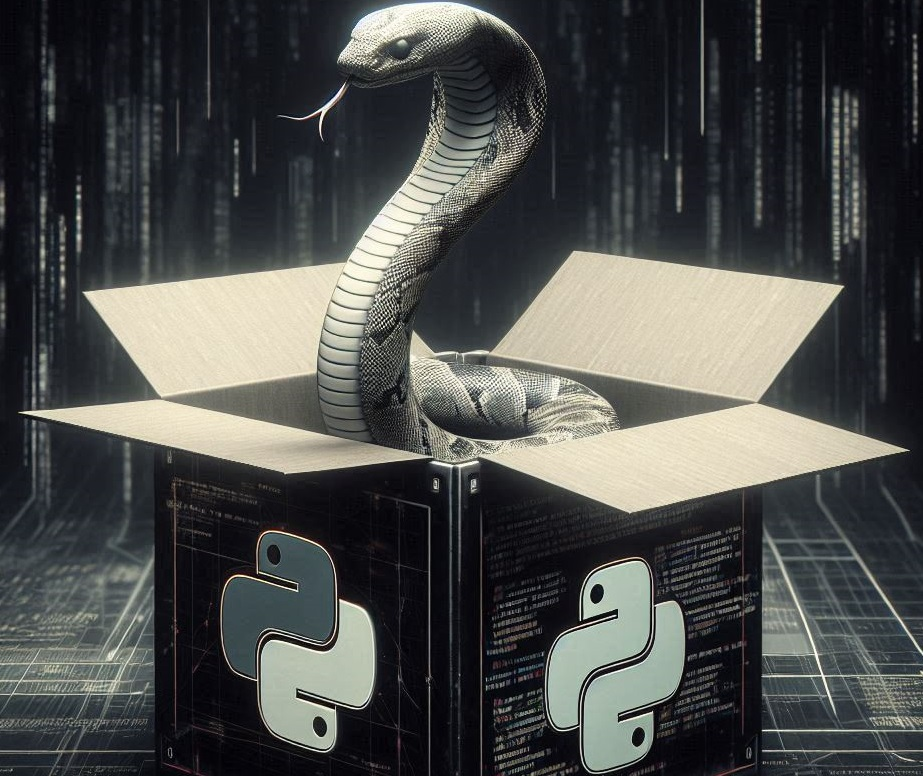

 
  

<h1 align="center">Criação De Pacotes Em Python</h1>

  

  

  

 

  <a href="#dart-sobre">Sobre</a> &#xa0; | &#xa0; 
  <a href="#memo-licença">Licença</a> &#xa0; | &#xa0;
  <a href="https://github.com/isabellazramos" target="_blank">Autor</a>

 

## :dart: Sobre ##

O projeto tem como objetivo aplicar os conhecimentos adquiridos durante o curso "Descomplicando a criação de pacotes de processamento de imagens em Python" ministrado por Karina Kato na plataforma Digital Innovation One (DIO).

A ideia principal do projeto é desenvolver um pacote Python que inclua funções para converter texto em áudio, áudio em texto, reconhecer entrada de audio e converter em texto, e converter arquivo .mp3 para .wav. O pacote será chamado `audio-processing-teste-math_bull`.

## :memo: Licença ##

Este projeto está sob licença MIT. Veja o arquivo [LICENSE](LICENSE.md) para mais detalhes.

Feito com :heart: por <a href="https://github.com/Mathbull" target="_blank">Matheus Santos</a>

&#xa0;

<a href="#top">Voltar para o topo</a>
